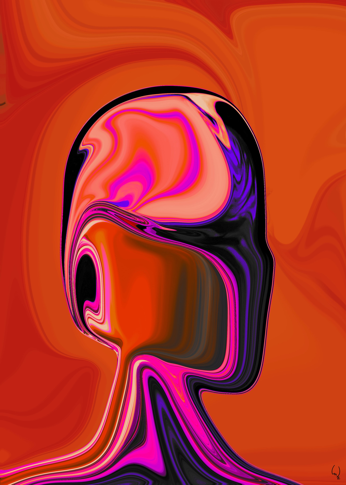
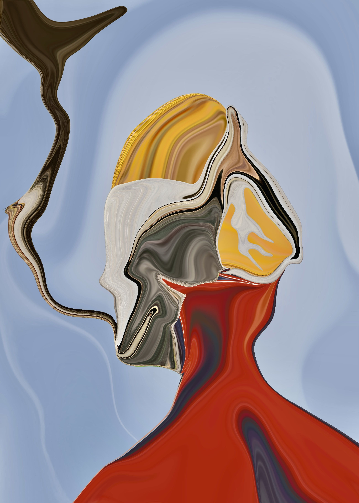
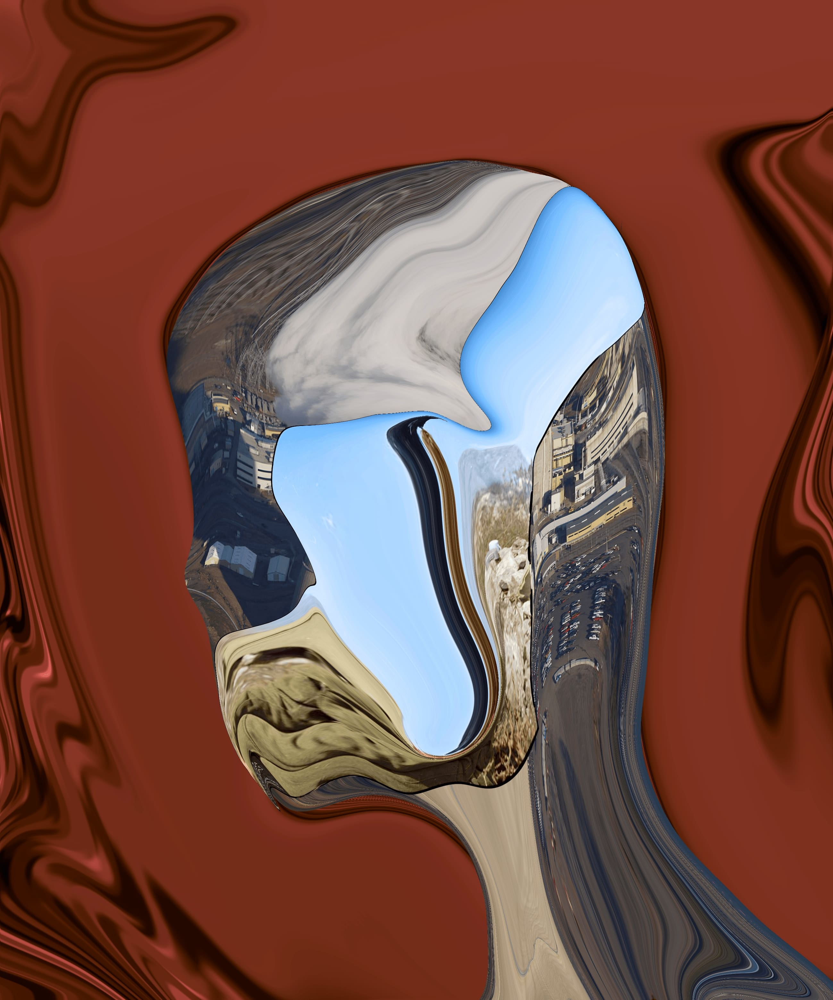

<!DOCTYPE html>
<html lang="fr">
<head>
    <meta charset="UTF-8">
    <meta name="viewport" content="width=device-width, initial-scale=1.0">
    <title>En-tête avec Image</title>
    <style>
        .header-image {
            display: block;
            margin: 0 auto; /* Centre l'image horizontalement */
            max-width: 100%; /* Assure que l'image ne dépasse pas la largeur de l'écran */
            height: auto; /* Maintient le ratio de l'image */
            width: 30%; /* Réduit la taille de l'image à 50% de sa largeur originale */
        }
    </style>
</head>
<body>
    
</body>
</html>


[Link to another page](./another-page.html).


# Bio

Max Zargha est un artiste franco-iranien diplômé de l’Université Paris 8 dans le domaine des arts. À travers ses collages, plusieurs intentions se manifestent : Celle de vouloir intriguer le spectateur jusqu'à esquisser un sourire sur son visage. Il lui arrive également de vouloir politiser son œuvre avec une conscience moralisatrice ; il aime aussi montrer la dualité de notre monde ainsi que nos propres inégalités sociologiques. Lorsqu'il laisse parler son inspiration sur tablette graphique, il n’a de cesse de découvrir de nouvelles techniques pour tenter de mettre en visuel les énergies subtiles et inconscientes de l’être humain. Fortement inspiré par les surréalistes, il illustre en globalité des êtres vivants, avec pour idée fixe de représenter leurs spectres énergétiques en liquéfaction.

## Galerie
<!DOCTYPE html>
<html lang="fr">
<head>
    <meta charset="UTF-8">
    <title>Carrousel Interactif</title>
    <style>
        .carousel {
            width: 60%;
            overflow: hidden;
            margin: 50px auto;
            position: relative;
            box-shadow: 0 4px 8px rgba(0,0,0,0.1);
        }

        .carousel-container {
            display: flex;
            width: calc(100% * 5); /* Assume 5 images */
            transition: transform 1s ease;
            cursor: pointer; /* Indicate clickable items */
        }

        .carousel-item {
            flex: 100%; /* Each item is 100% of carousel width */
        }

        .carousel-item img {
            width: 50%;
            height: 50%;
            display: block;
        }
    </style>
</head>
<body>
    <div class="carousel" onclick="nextImage()">
        <div class="carousel-container" id="carouselContainer">
            <div class="carousel-item">
                
            </div>
            <div class="carousel-item">
                
            </div>
            <div class="carousel-item">
                
            </div>
            <div class="carousel-item">
                
            </div>
            <div class="carousel-item">
                
            </div>
        </div>
    </div>

    <script>
        var currentIndex = 0;
        function nextImage() {
            var container = document.getElementById("carouselContainer");
            var totalItems = container.children.length;
            currentIndex++;
            if (currentIndex >= totalItems) {
                currentIndex = 0;
            }
            var newTranslateValue = -100 * currentIndex;
            container.style.transform = `translateX(${newTranslateValue}%)`;
        }
    </script>
</body>
</html>

</head>
<body>
    <div class="carousel">
        <div class="carousel-container">
            <div class="carousel-item">
                
            </div>
            <div class="carousel-item">
                
            </div>
            <div class="carousel-item">
                
            </div>
            <div class="carousel-item">
                
            </div>
            <div class="carousel-item">
                
            </div>
        </div>
    </div>
</body>
</html>


### Header 3

```js
// Javascript code with syntax highlighting.
var fun = function lang(l) {
  dateformat.i18n = require('./lang/' + l)
  return true;
}
```

```ruby
# Ruby code with syntax highlighting
GitHubPages::Dependencies.gems.each do |gem, version|
  s.add_dependency(gem, "= #{version}")
end
```

#### Header 4

*   This is an unordered list following a header.
*   This is an unordered list following a header.
*   This is an unordered list following a header.

##### Header 5

1.  This is an ordered list following a header.
2.  This is an ordered list following a header.
3.  This is an ordered list following a header.

###### Header 6

| head1        | head two          | three |
|:-------------|:------------------|:------|
| ok           | good swedish fish | nice  |
| out of stock | good and plenty   | nice  |
| ok           | good `oreos`      | hmm   |
| ok           | good `zoute` drop | yumm  |

### There's a horizontal rule below this.

* * *

### Here is an unordered list:

*   Item foo
*   Item bar
*   Item baz
*   Item zip

### And an ordered list:

1.  Item one
1.  Item two
1.  Item three
1.  Item four

### And a nested list:

- level 1 item
  - level 2 item
  - level 2 item
    - level 3 item
    - level 3 item
- level 1 item
  - level 2 item
  - level 2 item
  - level 2 item
- level 1 item
  - level 2 item
  - level 2 item
- level 1 item

### Small image


### Large image


### Definition lists can be used with HTML syntax.

<dl>
<dt>Name</dt>
<dd>Godzilla</dd>
<dt>Born</dt>
<dd>1952</dd>
<dt>Birthplace</dt>
<dd>Japan</dd>
<dt>Color</dt>
<dd>Green</dd>
</dl>

```
Long, single-line code blocks should not wrap. They should horizontally scroll if they are too long. This line should be long enough to demonstrate this.
